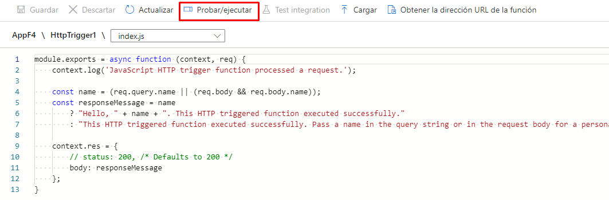

# Practica 4 con "Azure Functions"

*Crear un Azure Functions*

**Paso 1 _Functions_**
- Poner en la barra de busqueda "funciones" y elegir la opcion 

**Paso 2 _Crear App Services_**
- Primero debemos elegir el boton "Crear" 

- Ir a datos basicos
  

  - Debemos elegir en detalles del proyecto:
      - La suscripcion
      - El grupo de recursos previamente creado
      

  - Debemos elegir en detalles de instancia:
      - Nombre con el que queremos llamar la aplicacion
      - Elegir si queremos codigo o contenedor docker 
      - El entorno de ejecucion, en este caso Node.js
      - El sistema operativo
      - La region donde deseamos crearla
      

  - Debemos elegir el sistema operativo y el plan
      

- Dar en revisar y crear
  

- Dar en crear
  
      
**Paso 3 Abrir el recurso**
- Ir al recurso

- Ir a funciones
  

- Damos en crear
  

- Posteriormente elegimos el entorno de desarrollo, el HTTP trigger y finalmente damos en "crear"
     

    - Ahora iremos a "codigo y prueba"
    

    - Programamos el codigo y lo probamos
    

    - Insertamos el dato necesario y ejecutamos
    

    - Finalmente se nos mostrara la corrida exitosa de nuestra programacion
    

    - A continuacion podremos obtener URL y copiar el link para poder utilizarlo en el proyecto que deseemos
    

